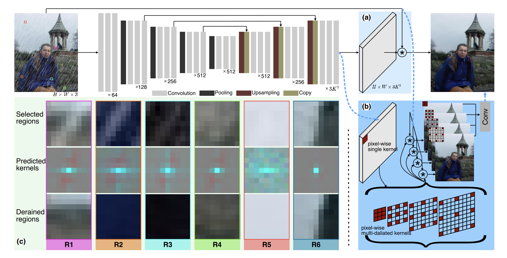
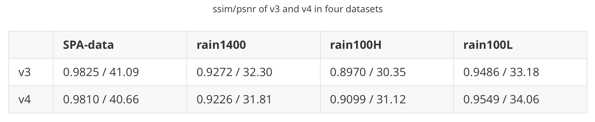

# EfficientDerain
we propose EfficientDerain for high-efficiency single-image deraining



## Requirements

- python 3.6
- pytorch 1.6.0
- opencv-python 4.4.0.44
- scikit-image 0.17.2

## Datasets
- Rain100L-old_version https://github.com/nnUyi/DerainZoo/blob/master/DerainDatasets.md
- Rain100H-old_version https://github.com/nnUyi/DerainZoo/blob/master/DerainDatasets.md
- Rain1400 https://xueyangfu.github.io/projects/cvpr2017.html
- SPA https://stevewongv.github.io/derain-project.html

## Pretrained models
Here is the urls of pretrained models (includes v3_rain100H, v3_rain1400, v3_SPA, v4_rain100H, v4_rain1400, v4_SPA) : 

direct download: 
http://www.xujuefei.com/models_effderain.zip

google drive:
https://drive.google.com/file/d/1OBAIG4su6vIPEimTX7PNuQTxZDjtCUD8/view?usp=sharing

baiduyun:
https://pan.baidu.com/s/1kFWP-b3tD8Ms7VCBj9f1kw (pwd: vr3g)

## Train

- The code shown corresponds to version **v3**, for **v4** change the value of argument "**rainaug**" in file "**./train.sh**" to the "**true**" (You need to unzip the "Streaks_Garg06.zip" in the "./rainmix")
- Change the value of argument "**baseroot**" in file "**./train.sh**" to **the path of training data**
- Edit the function "**get_files**" in file "**./utils**" according to the format of the training data
- Execute

```
sh train.sh
```

## Test

- The code shown corresponds to version **v3**
- Change the value of argument "**load_name**" in file "**./test.sh**" to **the path of pretained model**
- Change the value of argument "**baseroot**" in file "**./test.sh**" to **the path of testing data**
- Edit the function "**get_files**" in file "**./utils**" according to the format of the testing data
- Execute

```
sh test.sh
```

## Results

The specific results can be found in “**./results/data/DERAIN.xlsx**”




<table>
    <tr>
        <td ><center> <p align="center">GT vs RCDNet</p> </center></td>
        <td ><center> <p align="center">GT vs EfDeRain</p> </center></td>
        <td ><center> <p align="center">Input vs GT</p> </center></td>
    </tr>
    <tr>
        <td ><center> <p align="center">GT vs RCDNet</p> </center></td>
        <td ><center> <p align="center">GT vs EfDeRain</p> </center></td>
        <td ><center> <p align="center">Input vs GT</p> </center></td>
    </tr>
</table>

<table>
    <tr>
        <td ><center> <p align="center">GT vs v1</p> </center></td>
        <td ><center> <p align="center">GT vs v2</p> </center></td>
        <td ><center> <p align="center">GT vs v3</p> </center></td>
        <td ><center> <p align="center">GT vs v4</p> </center></td>
    </tr>
    <tr>
        <td ><center> <p align="center">GT vs v1</p> </center></td>
        <td ><center> <p align="center">GT vs v2</p> </center></td>
        <td ><center> <p align="center">GT vs v3</p> </center></td>
        <td ><center> <p align="center">GT vs v4</p> </center></td>
    </tr>
</table>

## Bibtex

```
@inproceedings{guo2020efficientderain,
      title={EfficientDeRain: Learning Pixel-wise Dilation Filtering for High-Efficiency Single-Image Deraining}, 
      author={Qing Guo and Jingyang Sun and Felix Juefei-Xu and Lei Ma and Xiaofei Xie and Wei Feng and Yang Liu},
      year={2021},
      booktitle={AAAI}
}
```

